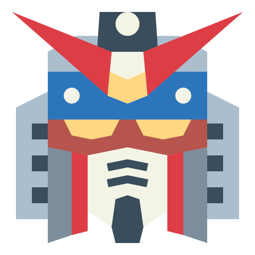
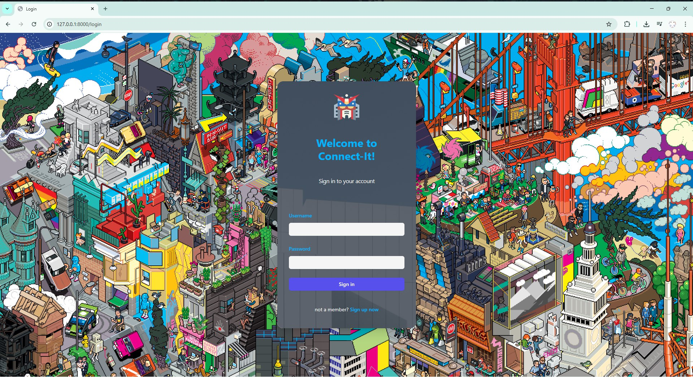
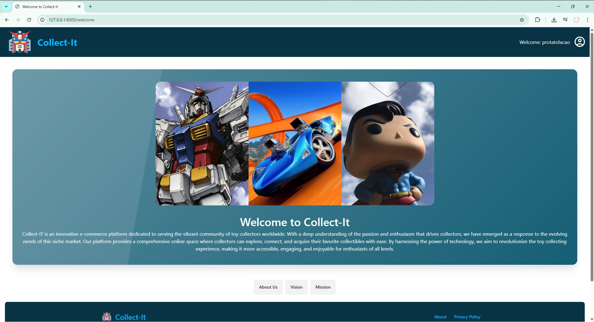
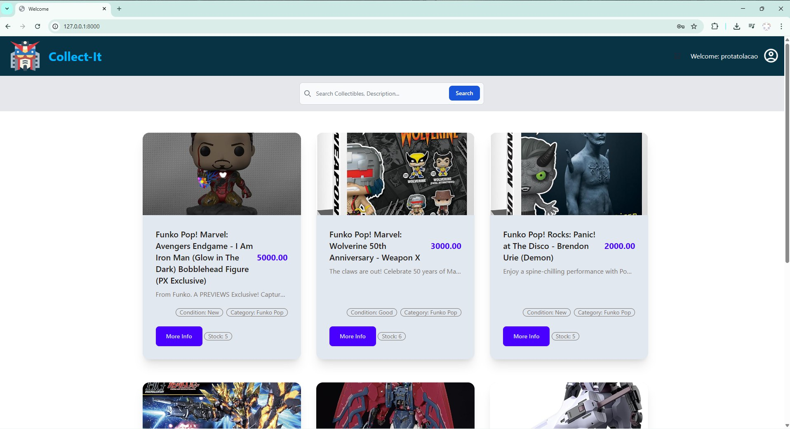
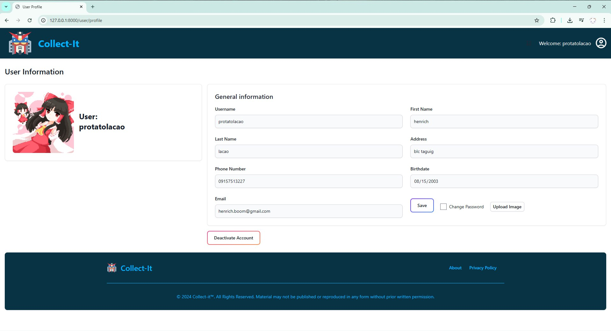
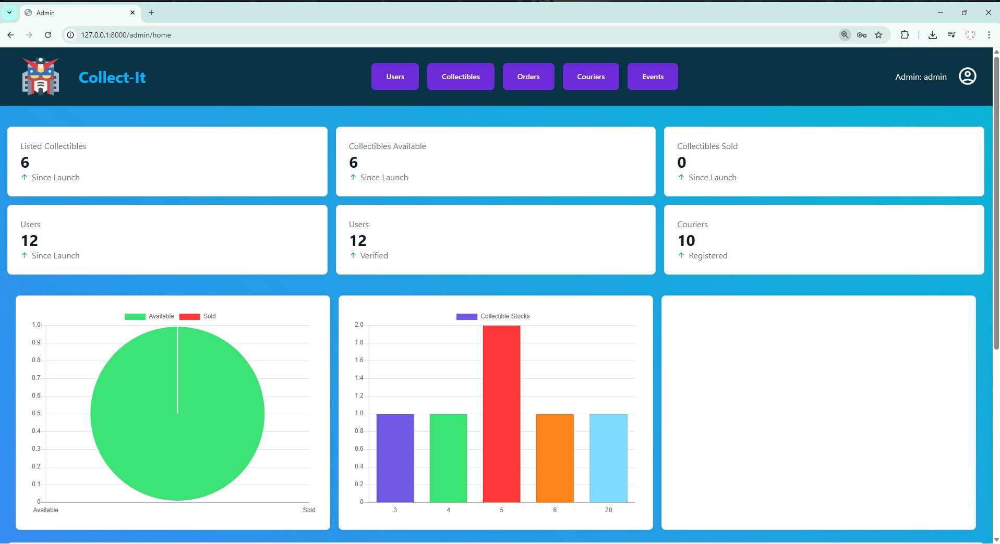
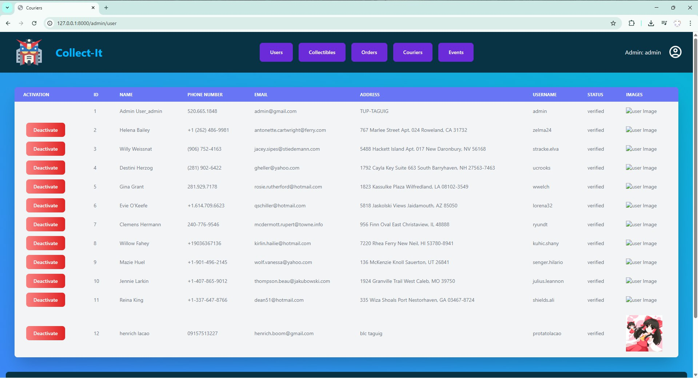

# 🎯 Collect-IT

<p align="center">
  
</p>

<p align="center">
  <strong>A Laravel-based marketplace for collectible enthusiasts</strong>
</p>

<p align="center">
  <a href="#features">Features</a> •
  <a href="#prerequisites">Prerequisites</a> •
  <a href="#installation">Installation</a> •
  <a href="#running-the-app">Running the App</a> •
  <a href="#app-demo">App Demo</a>
</p>

---

## 📖 About

**Collect-IT** is a web-based marketplace platform designed for collectors to buy, sell, and trade collectibles. Whether you're into Funko Pops, Gundam models, Hot Wheels, or vintage toys, Collect-IT provides a seamless platform to connect with fellow collectors.

## ✨ Features

- 🛒 **Marketplace** - Browse and purchase collectibles from other users
- 📦 **Inventory Management** - List and manage your own collectibles for sale
- 🛍️ **Shopping Cart** - Add items to cart and checkout
- 📊 **Admin Dashboard** - Comprehensive admin panel with analytics and charts
- 👥 **User Management** - Admin controls for user activation/deactivation
- 🚚 **Order Tracking** - Track your orders and shipping status
- ⭐ **Reviews** - Leave reviews on purchased collectibles
- 🎉 **Events** - Special promotional events with discounts
- 📧 **Email Verification** - Secure account verification via email

## 🔧 Prerequisites

Make sure the following software is installed on your system:

| Software | Download Link |
|----------|---------------|
| **XAMPP** | [Download](https://www.apachefriends.org/download.html) |
| **PHP** (8.1+) | Included with XAMPP |
| **Composer** | [Download](https://getcomposer.org/download/) |
| **Node.js** | [Download](https://nodejs.org/) |

## 🚀 Installation

### 1. Clone the Repository

```bash
git clone https://github.com/yourusername/CollectIT.git
cd CollectIT
```

### 2. Install PHP Dependencies

```bash
composer install
```

### 3. Install Node.js Dependencies

```bash
npm install
```

> **Note:** If you encounter peer dependency issues, use:
> ```bash
> npm install --legacy-peer-deps
> ```

### 4. Environment Setup

Copy the example environment file:

```bash
cp .env.example .env
```

### 5. Generate Application Key

```bash
php artisan key:generate
```

### 6. Database Setup

1. Start **XAMPP** and ensure **MySQL** is running
2. Create a database named `collectit` in phpMyAdmin (http://localhost/phpmyadmin)
3. Run migrations:

```bash
php artisan migrate
```

### 7. Create Storage Symlink

```bash
php artisan storage:link
```

### 8. Seed the Database (Optional)

Populate the database with sample data:

```bash
php artisan db:seed
```

## ▶️ Running the App

You need **two terminals** running simultaneously:

### Terminal 1 - Laravel Backend Server

```bash
php artisan serve
```

This starts the server at `http://localhost:8000`

### Terminal 2 - Vite Development Server

```bash
npm run dev
```

This compiles assets and enables hot-reloading.

---

## 📸 App Demo

### 🔐 Login Page
User authentication page where users can sign in to access the marketplace.



---

### ℹ️ About Page
Learn more about Collect-IT and the team behind the platform.



---

### 🏠 User Overview
The main marketplace view where users can browse available collectibles, search for items, and add them to their cart.



---

### 👤 User Profile
Manage your account settings, view your listed collectibles, and update personal information.



---

### 📊 Admin Dashboard
Comprehensive admin panel with statistics, charts, and analytics for monitoring platform activity including collectible counts, sales data, and user registrations.



---

### 👥 Admin User List
Admin interface for managing users - view all registered users, activate/deactivate accounts, and monitor user status.



---

## 🛠️ Tech Stack

- **Backend:** Laravel 10
- **Frontend:** Blade Templates, Tailwind CSS, DaisyUI
- **Database:** MySQL
- **Charts:** Chart.js, ConsoleTVs/Charts
- **Build Tool:** Vite
- **UI Components:** Flowbite

## 📁 Project Structure

```
CollectIT/
├── app/
│   ├── Http/Controllers/    # Application controllers
│   ├── Models/              # Eloquent models
│   └── Mail/                # Mailable classes
├── database/
│   ├── migrations/          # Database migrations
│   └── seeders/             # Database seeders
├── resources/
│   └── views/               # Blade templates
├── routes/
│   └── web.php              # Web routes
└── public/                  # Public assets
```

## 👨‍💻 Default Accounts

After seeding, you can use these accounts:

| Role | Username | Password |
|------|----------|----------|
| Admin | admin | password |
| User | (check UserSeeder) | password |

## 📝 License

This project is open-sourced software licensed under the [MIT license](https://opensource.org/licenses/MIT).

---

<p align="center">
  Made with ❤️ by the Collect-IT Team
</p>
